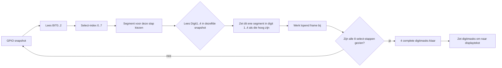

# Renovent 
De originele controller is een display met toetsen en 1 IC
De IC zet een 3 bit counter om in 8 select lijnen van het display.

Display is een  [liteon](https://eu.mouser.com/datasheet/3/281/1/LTC_4627JS.pdf)
De 8 segementen worden in volgorde aan gestuurd met een freq van 500uS
Welke segmenten verlicht worden gaat met digit 1 - 4

Het programma zal dus het continue het display moeten uitlezen en wat er op staat omzetten in een 4 char array.
Hiervan met gebruik gemaakt worden van mapping om een 8 bit array om te zetten in een Char. Waarschijnlijk kan de DP los en hebben we een 7 bitarray naar char mapping nodig.

De switches werken als volgt

Er is 1 output Key_node.
sw1 (OK) = key_node=1 als C=1 (counter=1)
Sw2 (+ ) = key_node=1 als D=1 (counter=5)
Sw3 (F ) = key_node=1 als E=1 (counter=6)
Sw4 (- ) = key_node=1 als DP=1 (counter=3)

## ESP32 aansluiting

In het ESP32-schema worden de relevante signalen van de originele controller eerst via een SN74LVC245 naar 3V3 gebracht. De ESP32 ziet dus alleen de 3V3-varianten van deze signalen.

### Ingangen voor het uitlezen van display en toetsen

- BIT0 -> BIT0_3V3 -> GPIO35
- BIT1 -> BIT1_3V3 -> GPIO36
- BIT2 -> BIT2_3V3 -> GPIO37
- Digit1 -> Digit1_3V3 -> GPIO38
- Digit2 -> Digit2_3V3 -> GPIO39
- Digit3 -> Digit3_3V3 -> GPIO40
- Digit4 -> Digit4_3V3 -> GPIO41
- KEY_NODE -> KEY_NODE_3V3 -> GPIO42

Deze acht ingangen zijn voldoende om het gemultiplexte display en de toetsstatus te reconstrueren.

### Uitgang voor toets simulatie

- KEY_DOWN <- GPIO43

KEY_DOWN gaat via een BSS138-transistor naar de originele schakeling. Daarmee kan de ESP32 een toetsdruk simuleren zonder direct 5V op een GPIO te zetten.

### Overige aansluitingen op het ESP32-bord

- SDA_1 -> GPIO7
- SCL_1 -> GPIO8
- LED -> GPIO12

## Aanpak in software

De displaycontroller loopt elke 500 us door de 8 segment-selects. De software leest dus niet "digit 1", daarna "digit 2", enzovoort, maar leest per segment-select in een keer de toestand van alle 4 digitlijnen.

Concreet:

1. `BIT0`, `BIT1` en `BIT2` vormen samen een tellerwaarde van `0..7`.
2. Die tellerwaarde bepaalt welk segment op dat moment actief is.
3. Tegelijk wordt gekeken welke van `Digit1..Digit4` hoog zijn.
4. Voor het actieve segment wordt dat bit gezet in alle digits die op dat moment hoog zijn.
5. Na 8 select-stappen is er een compleet 4-digit frame opgebouwd.

De mapping van de tellerwaarde naar segment is:

| BIT2 BIT1 BIT0 | index | segment |
| --- | --- | --- |
| 0 0 0 | 0 | A |
| 0 0 1 | 1 | C |
| 0 1 0 | 2 | B |
| 0 1 1 | 3 | DP |
| 1 0 0 | 4 | F |
| 1 0 1 | 5 | D |
| 1 1 0 | 6 | E |
| 1 1 1 | 7 | G |

Schematisch ziet een volledige scan er zo uit:



Eén interrupt-snapshot doet dus niet alles. Per snapshot gebeurt maar dit:

- bepaal welk segment nu actief is via `BIT0..2`
- lees tegelijk welke van de 4 digitlijnen actief zijn
- zet dat ene segment in de digits die op dat moment hoog zijn

Pas nadat dit 8 keer gebeurd is, hebben we voor alle 4 digits een volledig segmentmasker.

Je kunt het ook zo lezen: we lezen niet "4 displays na elkaar", maar per segment in een keer alle 4 displays.

Voorbeeld:

- `BIT2..0 = 000` betekent segment `A`
- als op dat moment `Digit1` en `Digit3` hoog zijn, dan krijgt digit 1 en digit 3 het segment `A`
- bij de volgende select-stap wordt bijvoorbeeld segment `C` op dezelfde manier verdeeld over de 4 digits
- na alle 8 segmenten kennen we van elke digit het volledige segmentmasker

`KEY_NODE` wordt in diezelfde scan meegelezen. Een actieve key tijdens een specifieke select-index betekent een specifieke toets.

## Interrupt of polling

De huidige implementatie gebruikt juist een interrupt op `BIT0`.

Waarom:

- de select-bits veranderen snel genoeg dat polling onnodig veel jitter gaf
- de reader wil alle relevante lijnen op exact hetzelfde moment samplen
- daarom leest de ISR direct een volledige GPIO-snapshot en reconstrueert daaruit de actuele select-index, digitlijnen en `KEY_NODE`

De implementatie in `src/display_reader.cpp` werkt zo:

1. `BIT0` triggert `onBit0ChangeInterrupt()` op elke flank.
2. De ISR leest direct `GPIO.in1.val`, zodat alle ingangssignalen uit hetzelfde tijdsmoment komen.
3. Uit `BIT0..2` wordt de verwachte select-index bepaald.
4. Als een select-stap ontbreekt of de volgorde niet klopt, wordt het huidige frame weggegooid.
5. Na select `7` is een volledig frame klaar.
6. De hoofdloop publiceert pas een frame als twee opeenvolgende complete frames gelijk zijn.

Daardoor is de reader robuuster tegen timingglitches en worden half-opgebouwde displaybeelden niet gepubliceerd.

## Huidige softwarebasis

Er is nu een eerste ESP32 software-opzet toegevoegd in de map `src`.

- `src/main.cpp` start WiFi, de webserver en de display reader.
- `src/wifiSetup.*` gebruikt WiFiManager, net als in het andere project.
- `src/display_reader.*` leest BIT0..2, Digit1..4 en KEY_NODE in en bouwt daar een stabiel displayframe van op.
- `src/webui/webui.*` publiceert een simpele HTTP API en serveert statische bestanden uit SPIFFS.
- `data/index.html` is een eenvoudige debugpagina.

### Webinterface

Na boot:

- hoofd-UI op poort 80
- WiFiManager portal op poort 8080

Beschikbare endpoints:

- `GET /api/status`
- `POST /api/keydown`

`/api/status` geeft onder andere terug:

- gedecodeerde displaytekst
- actieve toets op basis van `KEY_NODE`
- WiFi-status

### PlatformIO

Er is ook een `partitions/default.csv` toegevoegd zodat de SPIFFS data-partitie beschikbaar is voor de webpagina.

Voor lokaal gebruik zijn deze commando's relevant:

1. `platformio run`
2. `platformio run --target buildfs`
3. `platformio run --target uploadfs`
4. `platformio run --target upload`

### OTA artifacts lokaal bouwen

De automatische firmware-update leest OTA-bestanden uit `release/firmware`, `release/spiffs` en `release/latest.json`.

Deze artifacts worden lokaal gegenereerd door `scripts/generate_build_info.py`, dat als PlatformIO build hook meeloopt. De hook:

- berekent een aparte hash voor `src` en `data`
- bewaart per component precies een markerbestand `*.hash` in `src` en `ui-hashes`
- schrijft alleen een nieuwe build-id als de hash van die component gewijzigd is
- kopieert de nieuwe `.bin` naar `release/firmware` of `release/spiffs`
- werkt daarna `release/latest.json` bij

Voor een volledige lokale OTA release bouw je beide artifacts:

1. `platformio run -e esp32s3mini_ota`
2. `platformio run -e esp32s3mini_ota -t buildfs`

Daarna kun je de bijgewerkte bestanden in `release/` zelf committen of op een andere manier publiceren, zolang `release/latest.json` en de bijbehorende `.bin` bestanden bereikbaar blijven voor de ESP32.

### Backtrace decoderen

Een ESP32-S3 backtrace uit de WebUI of seriele output kun je direct tegen de actuele firmware-ELF symboliseren met:

```powershell
.\scripts\decode_backtrace.ps1 "0x4037EF71 -> 0x40377C96 -> 0x40376AEF"
```

Het script gebruikt standaard:

- `.pio/build/esp32s3mini_ota/firmware.elf`
- de PlatformIO `xtensa-esp32s3-elf-addr2line.exe`

Belangrijk: decode altijd tegen de ELF van dezelfde firmware-build als waarmee de crash is ontstaan, anders kloppen functies en regelnummers mogelijk niet.